# Manual de usuario - Plataforma LABM

Liga Antioqueña de Balonmano · Versión 1.0 · 10 de octubre de 2026

Esta guía está dirigida a las personas que crean, revisan y publican contenido. La [cartilla visual en PDF](cartilla-manual-usuario-labm.pdf) complementa este documento con una explicación breve por sección.

Las imágenes son capturas del WordPress local real del proyecto, realizadas el 10 de octubre de 2026. Contienen publicaciones de demostración, no certifican contenido institucional ni muestran el servidor de producción. Algunos controles están en inglés porque ese es el idioma del administrador capturado. Se indican las equivalencias en español. La disponibilidad de los menús depende de los permisos de cada cuenta.

## Índice

1. [Ingresar al administrador](#1-ingresar-al-administrador)
2. [Encontrar la sección correcta](#2-encontrar-la-sección-correcta)
3. [Crear, revisar, publicar y actualizar](#3-crear-revisar-publicar-y-actualizar)
4. [Actualidad: noticias y eventos](#4-actualidad-noticias-y-eventos)
5. [Selecciones: Piso y Playa](#5-selecciones-piso-y-playa)
6. [Documentos: publicar y sustituir PDF](#6-documentos-publicar-y-sustituir-pdf)
7. [Inicio: slides](#7-inicio-slides)
8. [Inicio: aliados y clubes](#8-inicio-aliados-y-clubes)
9. [Nosotros: presentación, misión, visión e integrantes](#9-nosotros-presentación-misión-visión-e-integrantes)
10. [Contacto y pie de página](#10-contacto-y-pie-de-página)
11. [Biblioteca de medios y galerías](#11-biblioteca-de-medios-y-galerías)
12. [Retirar y recuperar una publicación](#12-retirar-y-recuperar-una-publicación)
13. [Resolver problemas frecuentes](#13-resolver-problemas-frecuentes)
14. [Lista de revisión y límites del panel](#14-lista-de-revisión-y-límites-del-panel)

## 1. Ingresar al administrador

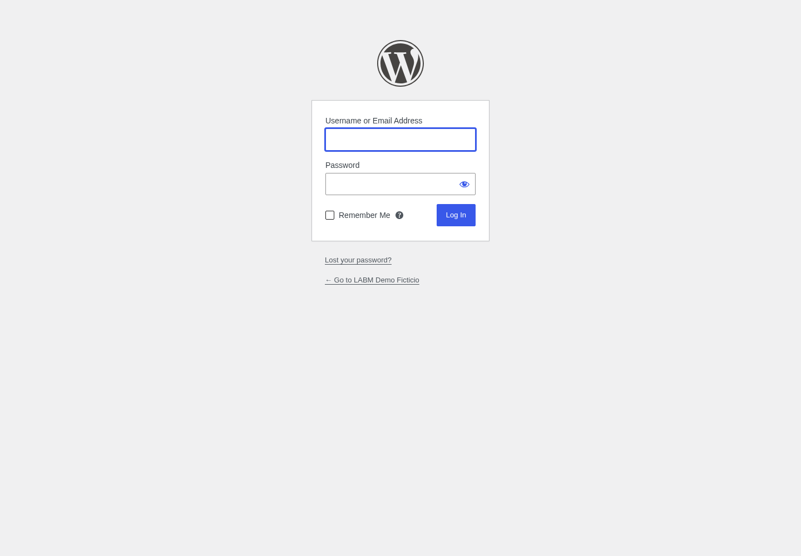

1. Abre la dirección de tu plataforma seguida de `/wp-admin/`.
2. En el entorno local del proyecto, la dirección es `http://localhost:8080/wp-admin/`. En producción utiliza el dominio institucional que te entregue la administración.
3. Escribe tu usuario o correo en **Username or Email Address / Nombre de usuario o correo electrónico**.
4. Escribe tu contraseña en **Password / Contraseña**.
5. Pulsa **Log In / Acceder**.
6. Comprueba que aparezca **Dashboard / Escritorio** y el menú lateral.

Si olvidaste tu contraseña, usa **Lost your password? / ¿Has olvidado tu contraseña?**. Si no recibes el correo, pide ayuda al administrador. No compartas una cuenta entre varias personas.

En el proyecto local, el responsable técnico dispone de la configuración en `.env`. Ese archivo no forma parte de las instrucciones ni de los adjuntos que se entregan a los editores; solicita tu cuenta de trabajo por el canal acordado.

## 2. Encontrar la sección correcta

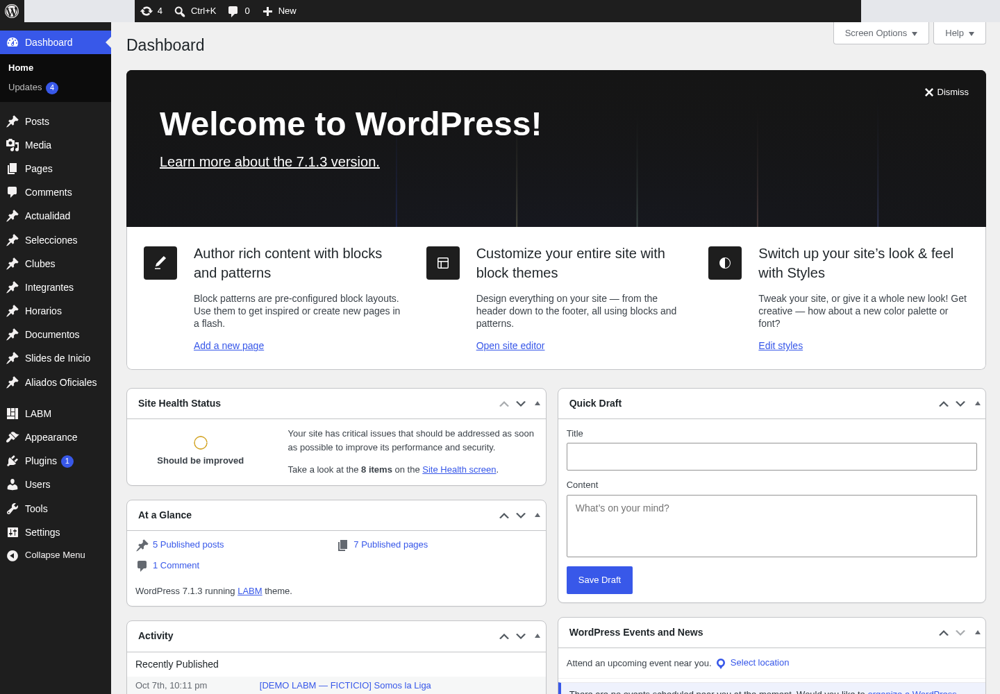

El menú público y el menú del administrador tienen funciones distintas. Para publicar contenido, usa el menú del administrador.

| Qué quieres actualizar | Menú del administrador | Dónde se refleja |
| --- | --- | --- |
| Una noticia o un evento | **Actualidad** | Actualidad y selecciones automáticas de contenido en Inicio |
| Una participación, convocatoria o logro de Piso/Playa | **Selecciones** | Listado de la modalidad y detalle individual |
| Un archivo público PDF | **Documentos** | Catálogo público de Documentos |
| Una diapositiva de portada | **Slides de Inicio** | Carrusel de Inicio |
| Un logo de aliado | **Aliados Oficiales** | Franja de aliados de Inicio |
| Un club asociado | **Clubes** | Sección de clubes de Inicio |
| Una persona de la Liga | **Integrantes** | Equipo de Nosotros, según su grupo |
| Banner de Nosotros, Misión, Visión o banner de Documentos | **Posts / Entradas** | Bloques institucionales conectados por identificador |
| Datos y enlaces del pie de página | **LABM** | Footer; correo y redes compartidos con Contacto |
| Archivos e imágenes | **Media / Medios** | Biblioteca usada por las publicaciones |
| Contenedores institucionales | **Pages / Páginas** | Páginas estructurales del sitio |

**Horarios** existe como tipo de contenido en el administrador, pero no se muestra como sección de Inicio en la implementación actual. No publiques un horario esperando que aparezca automáticamente en la portada.

## 3. Crear, revisar, publicar y actualizar

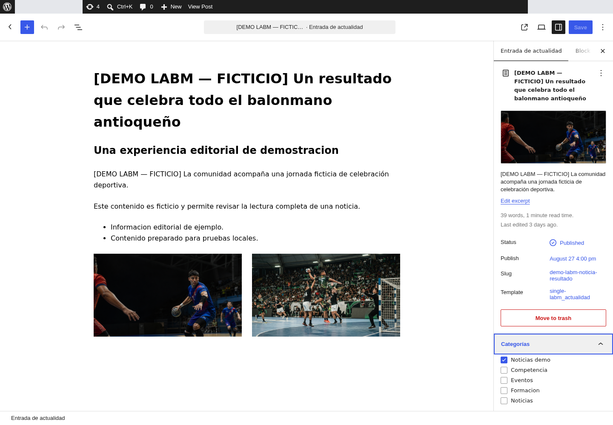

### Crear una publicación

1. Abre el menú de la sección correcta.
2. Pulsa **Añadir… / Add Post** en esa sección.
3. Escribe un título claro. Evita copiar el prefijo de demostración `[DEMO LABM - FICTICIO]` de las capturas.
4. Escribe el contenido en el editor de bloques. Usa el botón **+** para insertar párrafos, encabezados, listas, imágenes o galerías.
5. Abre la pestaña de la publicación, no solamente **Block / Bloque**, en el panel derecho.
6. Completa imagen destacada, extracto y clasificaciones según la sección.
7. Guarda como **Draft / Borrador** mientras revisas la información. Si necesitas revisión de otra persona, sigue el proceso editorial acordado antes de publicar.
8. Usa **Preview / Vista previa** cuando esté disponible. Comprueba el texto, las imágenes, los enlaces y la visualización móvil.
9. Pulsa **Publish / Publicar** y confirma en el panel de publicación.
10. Abre la página pública correspondiente y verifica el resultado.

### Editar una publicación existente

1. Busca el título en el listado de su sección.
2. Abre el título o pulsa **Edit / Editar** bajo la fila.
3. Realiza los cambios.
4. Pulsa **Save / Guardar**, **Update / Actualizar** o la acción equivalente del editor que muestre tu instalación.
5. Abre la página pública y comprueba los cambios guardados.

**Guardar no siempre significa publicar.** Revisa **Status / Estado**: una publicación en borrador o privada no aparece en los listados públicos de LABM. La fecha de publicación influye en el orden de Actualidad y Selecciones; no la cambies sólo para corregir una frase.

## 4. Actualidad: noticias y eventos

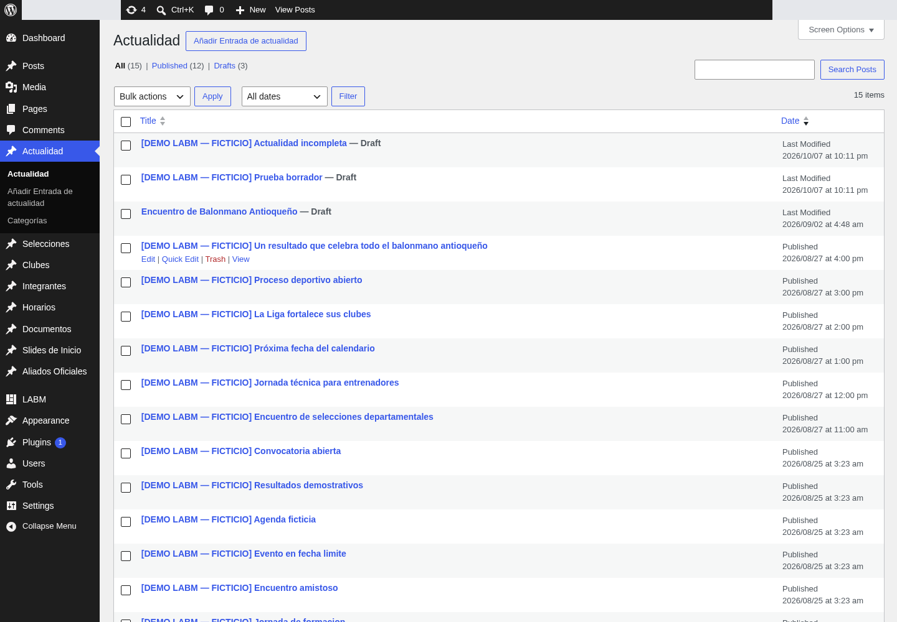

1. Entra en **Actualidad > Añadir Entrada de actualidad**.
2. Escribe el título de la noticia o del evento.
3. En el cuerpo, explica qué ocurrió o qué se realizará. Incluye fecha, lugar, participantes y detalles relevantes en texto comprensible.
4. Usa encabezados para dividir textos largos. Agrega una galería con bloques si hay varias fotografías.
5. En **Categorías**, asigna las categorías correspondientes. Abre ese apartado si está plegado.
6. En **Set featured image / Establecer imagen destacada**, elige una fotografía representativa.
7. Añade un extracto breve en **Add an excerpt… / Añadir un extracto…**. Este resumen se reutiliza en tarjetas.
8. Guarda el borrador, revisa y publica.
9. Comprueba el listado público de **Actualidad** y abre el detalle de tu publicación.

La portada consulta las publicaciones de Actualidad automáticamente. La publicación destacada del bloque de noticias depende de su orden editorial; no existe en el código actual un interruptor general de “destacar esta noticia”.

Para el evento destacado de Inicio existe el dato adicional `labm_fecha_evento`, con fecha en formato `AAAA-MM-DD`. El panel capturado no ofrece un formulario dedicado para este dato: si no tienes habilitados los campos personalizados, solicita apoyo al administrador. No confundas la fecha del evento con **Publish / Fecha de publicación**.

## 5. Selecciones: Piso y Playa

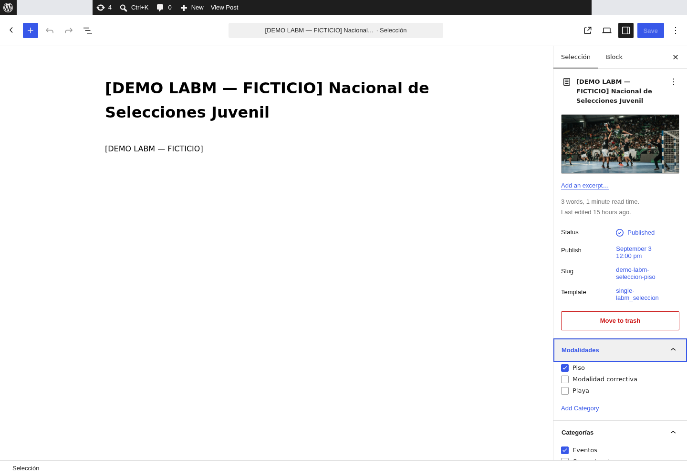

### Publicar una participación o registro

1. Entra en **Selecciones > Añadir Selección**.
2. Escribe el nombre de la participación, torneo, convocatoria o logro.
3. Describe el proceso en el cuerpo. Incluye categoría deportiva, ciudad, año, resultados y contexto cuando corresponda.
4. Abre **Modalidades** en el panel derecho y selecciona **Piso** o **Playa**. Para una publicación que pertenece a una sola modalidad, asigna solamente esa modalidad.
5. Completa **Categorías** con el tipo de publicación correspondiente.
6. Establece una imagen destacada y agrega una galería al cuerpo si necesitas varias fotos.
7. Escribe un extracto que permita entender el contenido antes de abrirlo.
8. Revisa y publica.
9. En el menú público abre **Selecciones > Balonmano Piso** o **Balonmano Playa** y comprueba que el registro aparezca en el listado adecuado.
10. Abre la interna: deben mantenerse resaltados el padre **Selecciones** y la modalidad del artículo.

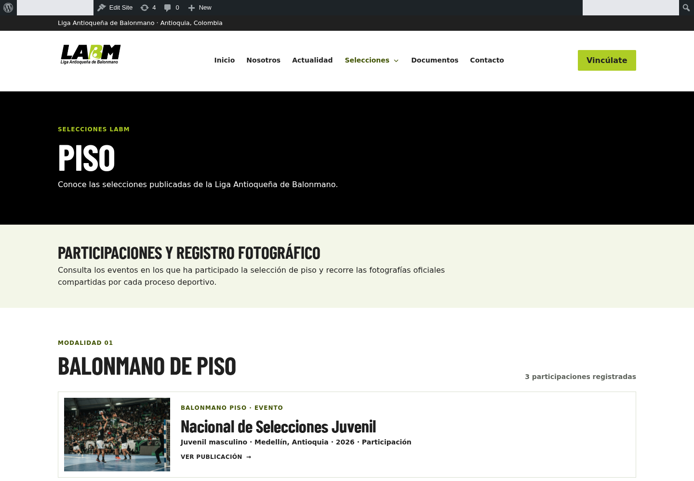

**Modalidad** y **Categorías** no son intercambiables. La modalidad determina el listado Piso/Playa y el estado activo del menú. El campo adicional `labm_modalidad_detalle` permite un texto breve de contexto de la tarjeta; no sustituye la taxonomía Modalidades. Si ese dato no está visible en tu editor, solicita su habilitación o edición al administrador.

El padre **Selecciones** abre el submenú por hover o clic; no lleva a una página. En móvil primero abre el menú general y luego Selecciones. Los enlaces de las modalidades sí navegan a sus listados.

## 6. Documentos: publicar y sustituir PDF

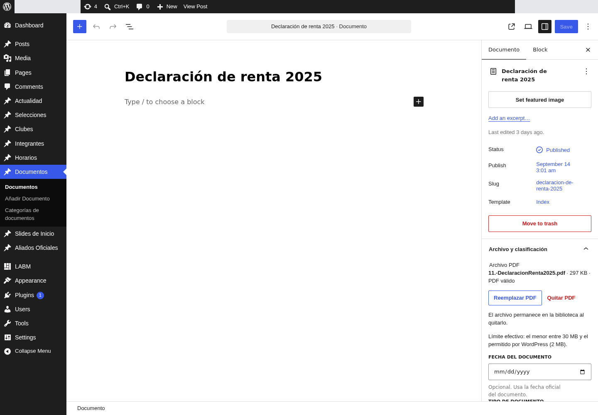

### Publicar un documento

1. Entra en **Documentos > Añadir Documento**.
2. Escribe un título que identifique el archivo, por ejemplo su nombre institucional y año.
3. En el panel derecho abre **Archivo y clasificación**.
4. Pulsa **Seleccionar o subir PDF**.
5. Elige un PDF de la biblioteca o súbelo desde tu equipo. Confirma la selección en el selector de medios.
6. Comprueba el nombre, tamaño y estado del archivo asociado.
7. Si corresponde, completa **Fecha del documento** con su fecha oficial. Este campo es opcional.
8. Selecciona un solo **Tipo de documento**. El vocabulario inicial incluye Documento general, Acta, Certificado, Circular, Resolución, Reglamento, Informe, Convocatoria y Otro; el administrador puede gestionar los tipos disponibles.
9. Publica y confirma.
10. Abre **Documentos** en el sitio público. Busca el título y comprueba las acciones **Ver PDF** y **Descargar**.

El límite efectivo es el menor entre **30 MB** y el límite permitido por WordPress. En el entorno de las capturas el panel indica **2 MB**. Mira siempre el límite que muestra tu instalación; no supongas que acepta 30 MB.

El PDF debe existir en la biblioteca, ser accesible para tu cuenta y ser un PDF válido. Cambiar la extensión de un archivo no lo convierte en PDF. No hace falta una imagen destacada para asociar el documento: utiliza el panel **Archivo y clasificación**.

### Reemplazar un PDF

1. Abre el documento existente.
2. Pulsa **Reemplazar PDF**.
3. Selecciona el nuevo archivo y comprueba sus datos.
4. Actualiza título, fecha y tipo si corresponde.
5. Guarda la publicación.
6. Comprueba **Ver PDF** y **Descargar** desde el sitio público.

**Quitar PDF** sólo desvincula el archivo de la publicación; el archivo permanece en la biblioteca. Una publicación sin PDF válido puede ser bloqueada o retirada del estado publicable por la validación. Para dejar de mostrar un documento usa un borrador o la papelera, no elimines primero su archivo de Medios.

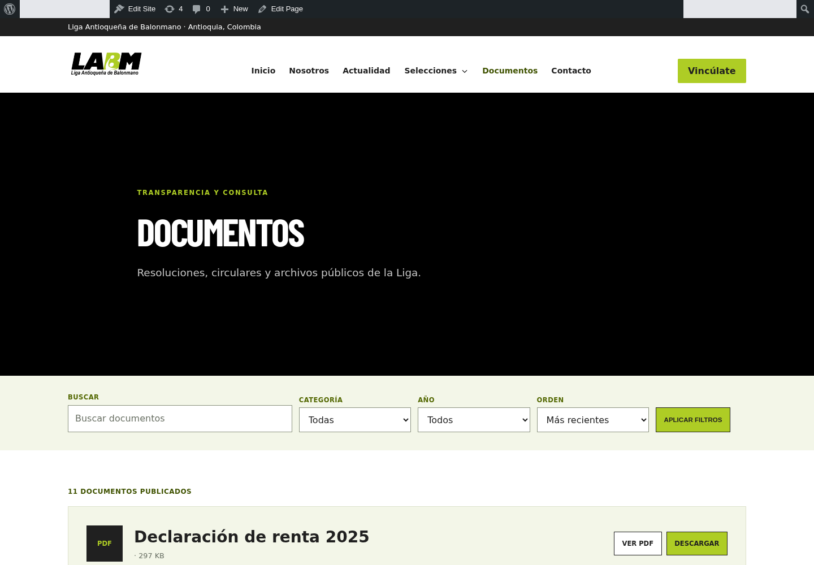

## 7. Inicio: slides

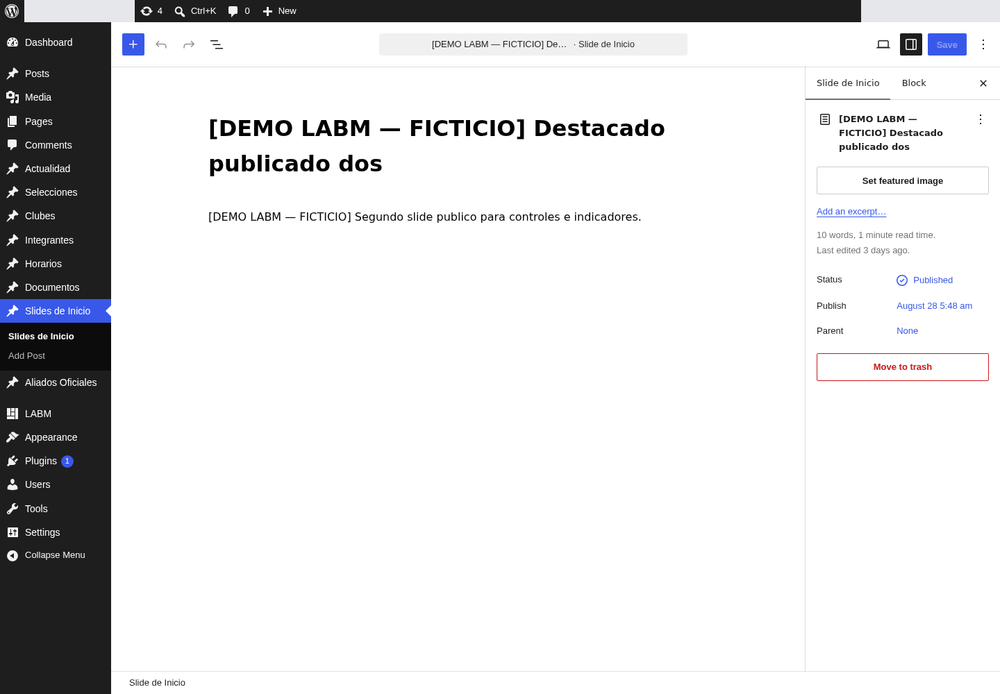

1. Abre **Slides de Inicio**.
2. Pulsa **Add Post / Añadir** o edita una diapositiva existente.
3. Escribe el título que se mostrará en el carrusel.
4. Añade el texto breve al contenido o al extracto según el texto editorial existente.
5. Asigna una **imagen destacada**. Título e imagen son obligatorios para publicar.
6. Revisa el enlace de destino y el texto del botón si la diapositiva debe tener una llamada a la acción.
7. Publica o guarda los cambios.
8. Abre Inicio y recorre el carrusel hasta esa diapositiva. Comprueba que el texto sea legible y el botón lleve al destino correcto.

El destino del botón se guarda en `labm_destino_url` y su etiqueta en `labm_cta_texto`. Son campos personalizados, no campos del panel de Documentos. Si no aparecen en tu editor, pide apoyo al administrador; no se incluye un botón ficticio para editarlos en esta guía. Sin destino, la diapositiva no muestra ese enlace.

Las diapositivas publicadas se ordenan por orden editorial y luego por título. El tipo admite atributos de página; según la versión del editor el orden puede aparecer en **Post Attributes / Atributos** o en **Quick Edit / Edición rápida** del listado. Si el control no está disponible para tu cuenta, solicita el orden al administrador. No alteres fechas para ordenar el carrusel.

Las diapositivas no tienen una página pública individual. Se verifican en Inicio.

## 8. Inicio: aliados y clubes

### Aliados Oficiales

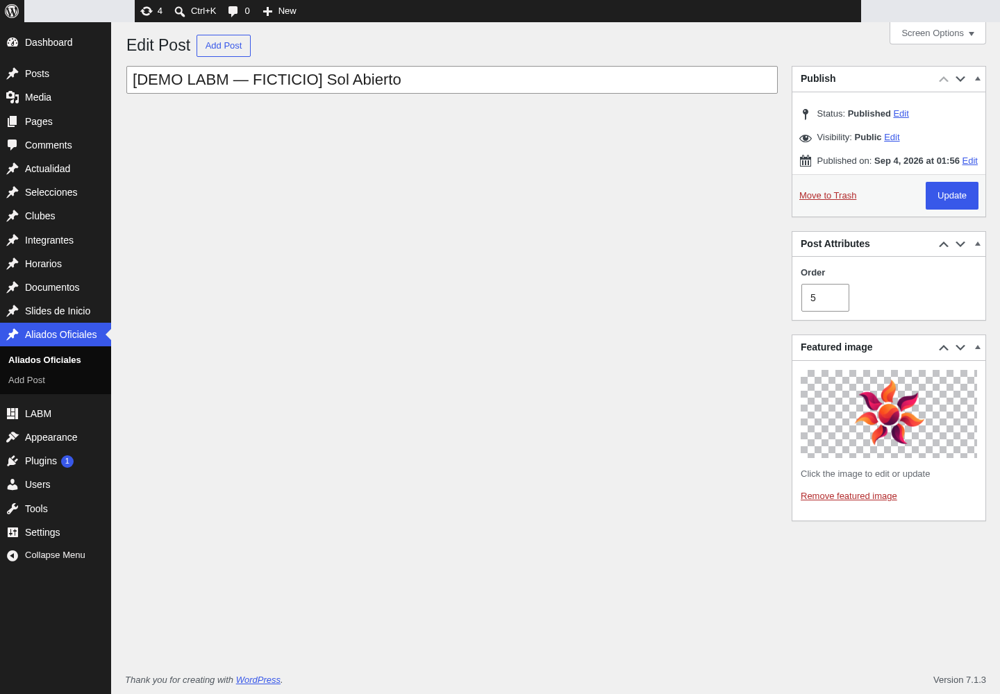

1. Abre **Aliados Oficiales > Add Post / Añadir**.
2. Escribe el nombre del aliado en el título.
3. En **Featured image / Imagen destacada**, carga o selecciona el logo oficial.
4. Conserva sus proporciones y añade un texto alternativo identificable en Medios.
5. En **Post Attributes > Order / Atributos > Orden**, define el orden si tu rol lo permite. Un número menor aparece antes.
6. Publica o actualiza.
7. Comprueba la franja **Aliados Oficiales** de Inicio.

Título y logo son necesarios para publicar. Este editor es clásico en el entorno capturado; su aspecto difiere del editor de bloques. El registro de un aliado no crea una página pública individual ni un campo de enlace externo en la implementación actual.

### Clubes

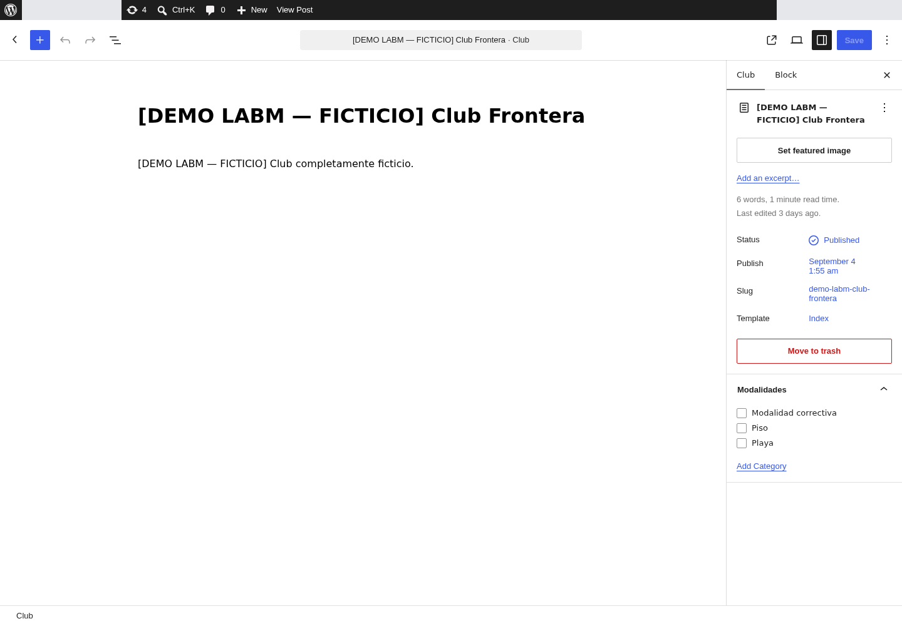

1. Entra en **Clubes > Añadir Club**.
2. Escribe el nombre del club y su descripción.
3. Selecciona el logo como imagen destacada.
4. Asigna la modalidad correspondiente.
5. Añade un extracto breve y publica.
6. Revisa **Clubes asociados** en Inicio y el enlace al club.

La sección de Inicio muestra una selección limitada de clubes publicados. Si hay más clubes que espacios, publicar uno no garantiza su presencia inmediata en la portada. El dato `labm_ciudad` está registrado como campo personalizado; no se debe prometer un campo visual específico si tu editor no lo muestra.

## 9. Nosotros: presentación, misión, visión e integrantes

### Textos institucionales

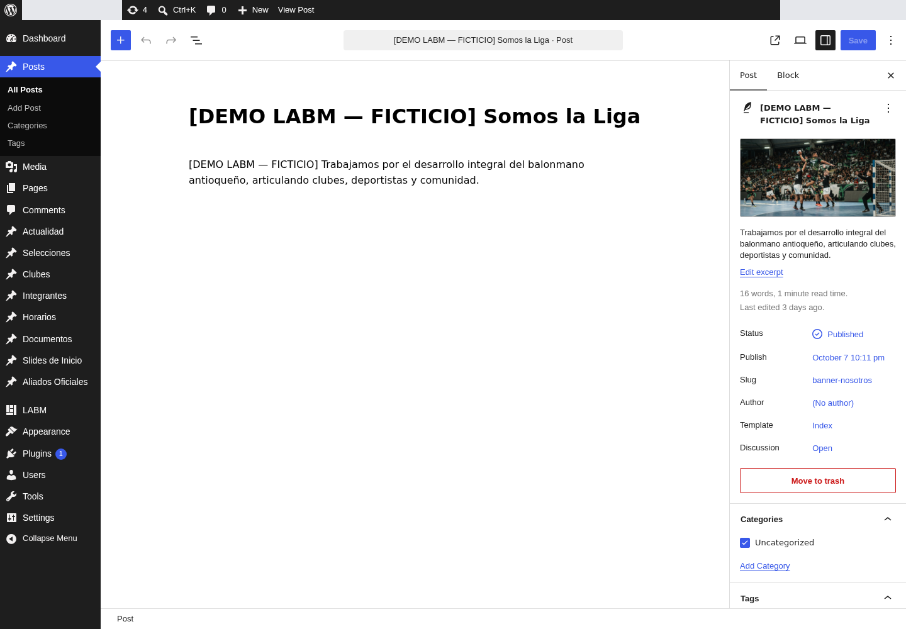

Los bloques principales de Nosotros se alimentan de **Posts / Entradas** con identificadores concretos, no únicamente del contenido de **Pages > Nosotros**.

| Bloque público | Identificador / Slug de la entrada |
| --- | --- |
| Banner principal de Nosotros | `banner-nosotros` |
| Misión | `mision-nosotros` |
| Visión | `vision-nosotros` |
| Encabezado de Documentos | `banner-documentos` |

1. Entra en **Posts / Entradas**.
2. Localiza la entrada institucional que quieres actualizar. En edición, comprueba **Slug / Identificador** con la tabla anterior.
3. Cambia su título y texto. El bloque usa primero el extracto; si está vacío, usa el contenido. Si cambias sólo el cuerpo y hay extracto, actualiza también el extracto.
4. Para el banner de Nosotros, revisa la imagen destacada.
5. Guarda y verifica Nosotros o Documentos en el sitio público.

Conserva el identificador. Cambiarlo o crear otra entrada con un nombre parecido no garantiza que el bloque la use. Estas entradas deben estar publicadas y contener título y texto para que su sección pueda mostrarse.

### Integrantes

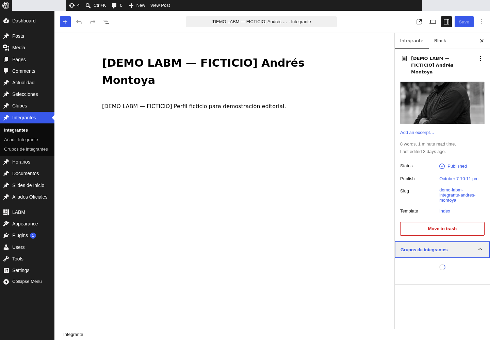

1. Entra en **Integrantes > Añadir Integrante**.
2. Escribe el nombre de la persona.
3. Añade una fotografía como imagen destacada.
4. En **Grupos de integrantes**, asigna el grupo correspondiente: Comité, Entrenadores o Representantes.
5. Completa el cargo mediante el campo personalizado `labm_cargo`. Si no lo tienes visible, solicita apoyo al administrador.
6. Guarda y publica cuando todos los datos estén revisados.
7. Abre Nosotros y comprueba el nombre, fotografía, cargo y filtro de grupo.

Un integrante puede estar publicado y aun así no aparecer si falta el nombre, la foto, el cargo o el grupo. La sección reconoce los grupos con identificadores `comite`, `entrenadores` y `representantes`; crear un grupo con otro identificador requiere revisar su compatibilidad con los filtros.

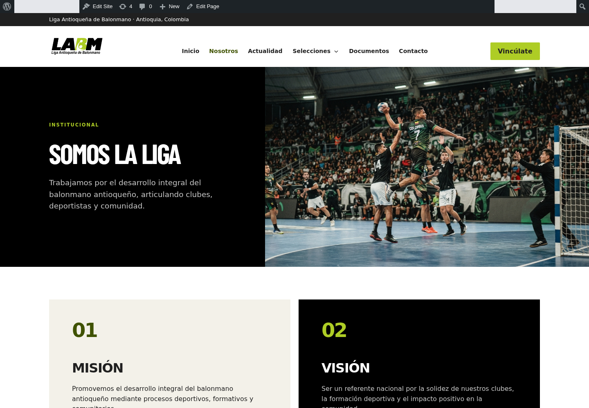

## 10. Contacto y pie de página

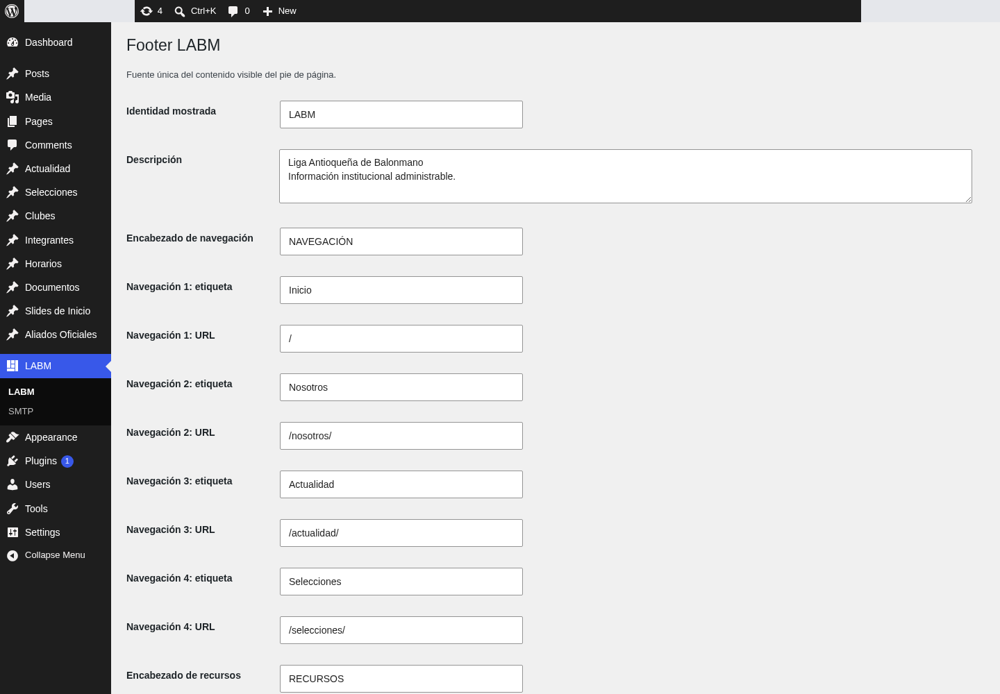

### Datos compartidos

1. Abre **LABM**, que muestra **Footer LABM**. Si no aparece, solicita acceso al administrador.
2. Revisa identidad, descripción, encabezados, etiquetas y URLs de navegación y recursos.
3. Modifica **Correo** y los campos de etiqueta/URL de Facebook e Instagram cuando corresponda.
4. Revisa la etiqueta y URL de la política de datos.
5. Baja al final y pulsa **Save Changes / Guardar cambios**.
6. Comprueba el footer en varias páginas y la sección pública Contacto.

Correo y redes se reutilizan en Contacto. Las etiquetas y URLs del footer no cambian el menú principal. El teléfono, dirección, mapa y algunos textos de Contacto están definidos en el tema/plugin actual y no tienen campos editables en esta pantalla: solicita esos cambios al responsable técnico.

### Entrega de mensajes

El formulario Contacto envía correo a los destinatarios configurados. No existe en esta implementación una bandeja editorial de mensajes dentro de WordPress. El correo visible en la página y la lista de destinatarios SMTP son configuraciones diferentes.

**LABM > SMTP** pertenece al administrador. Allí se gestionan los datos permitidos de envío y se ofrece una prueba de correo. La contraseña se administra mediante configuración técnica y no se muestra como campo editorial. Esta cartilla no contiene credenciales. No pulses **Enviar prueba** durante una simple revisión: esa acción sí envía un correo.

## 11. Biblioteca de medios y galerías

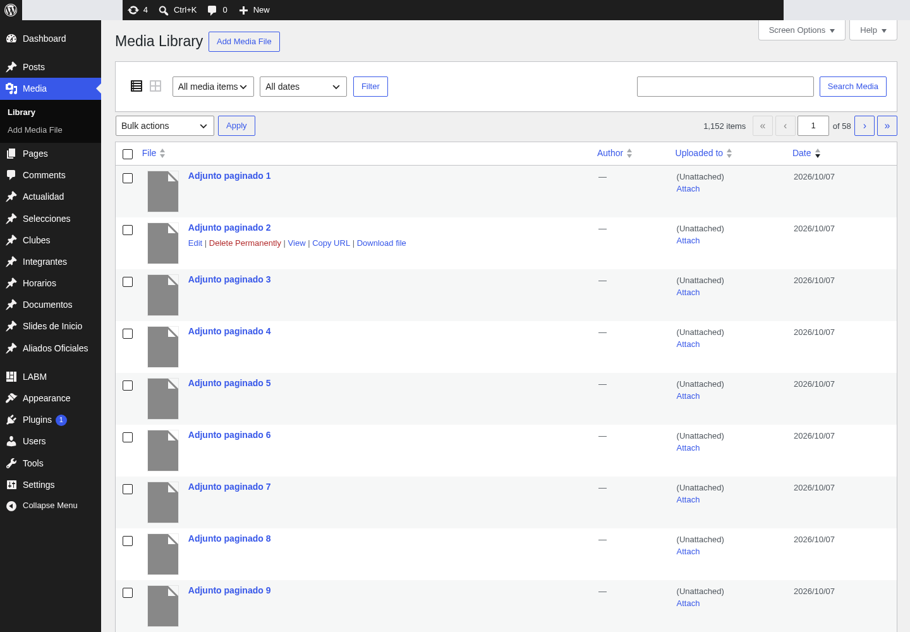

1. Entra en **Media / Medios** para buscar archivos existentes antes de subir duplicados.
2. Para una carga, usa **Add Media File / Añadir archivo** o el selector de medios de la publicación.
3. Revisa que el nombre y formato del archivo sean adecuados.
4. En una imagen, completa **Alternative Text / Texto alternativo** con una descripción útil. Para un logo, identifica a la organización.
5. En el editor, usa **Set featured image / Establecer imagen destacada** para la imagen principal.
6. Para varias fotografías, inserta el bloque **Gallery / Galería** con el botón **+** y selecciona las imágenes.
7. Ordena la galería y revisa sus pies de foto antes de publicar.

Imagen destacada y galería cumplen funciones diferentes. Una galería en el cuerpo no sustituye automáticamente la imagen destacada. No borres un archivo compartido desde Medios sin comprobar dónde se utiliza: eliminarlo puede romper otras publicaciones.

## 12. Retirar y recuperar una publicación

### Retirar sin borrar definitivamente

1. Abre la publicación.
2. Cambia **Status / Estado** a **Draft / Borrador**, si quieres conservarla para revisión, y guarda.
3. Comprueba que ya no aparezca en el listado público.

También puedes usar **Move to trash / Mover a la papelera**. No uses **Delete permanently / Borrar permanentemente** como parte de una revisión rutinaria.

### Recuperar desde la papelera

1. Abre el listado de la sección.
2. Entra en **Trash / Papelera**.
3. Localiza la publicación y usa **Restore / Restaurar**.
4. Abre el editor y revisa estado, contenido, imagen y clasificación.
5. Publica de nuevo sólo cuando hayas verificado los datos. Restaurar desde la papelera no debe asumirse como una aprobación editorial.

## 13. Resolver problemas frecuentes

| Problema | Qué comprobar |
| --- | --- |
| No aparece un menú del administrador | Rol y permisos de tu cuenta; solicita acceso al administrador. |
| Una publicación no aparece en el sitio | Estado publicado, sección correcta y filtros activos. Revisa también los límites de elementos de la portada. |
| Una selección aparece en el listado equivocado | Taxonomía **Modalidades**, no sólo el texto del título o el campo de detalle. |
| No se resalta la modalidad en la interna | Asignación Piso/Playa de esa selección; informa al administrador si está correcta y el fallo persiste. |
| Un integrante publicado no aparece | Nombre, cargo `labm_cargo`, imagen destacada y grupo compatible. |
| Un slide o aliado no se puede publicar | Título e imagen destacada o logo obligatorios. |
| Un cambio de texto institucional no se ve | Identificador de la entrada y extracto existente; el extracto tiene prioridad sobre el cuerpo. |
| No se guarda un PDF | Archivo realmente PDF, disponible, válido, bajo el límite efectivo y permitido para tu cuenta. |
| No veo los datos adicionales de un slide o integrante | Son campos personalizados sin formulario dedicado; pide su habilitación o edición al administrador. |
| El formulario Contacto falla al enviar | Reporta fecha, pantalla y mensaje al administrador SMTP; no compartas contraseñas. |
| Guardé, pero sigo viendo lo anterior | Confirma que guardaste la publicación correcta, abre su página pública y recarga. Si continúa, solicita revisión de caché al administrador. |

## 14. Lista de revisión y límites del panel

### Antes de publicar

- [ ] La publicación pertenece a la sección correcta.
- [ ] Título y texto están completos y revisados.
- [ ] No quedan textos de demostración usados como información institucional.
- [ ] Imagen destacada, logo o PDF corresponden a la publicación.
- [ ] Fotografías y archivos tienen autorización de uso.
- [ ] Las imágenes importantes tienen texto alternativo.
- [ ] La modalidad, grupo o tipo está correctamente asignado.
- [ ] El extracto resume el contenido y no contradice el cuerpo.
- [ ] Fechas y enlaces son correctos.
- [ ] Se revisó la vista previa y la visualización móvil.
- [ ] El estado final es el acordado: borrador, revisión o publicado.

### Después de publicar

- [ ] Se comprobó el listado público correspondiente.
- [ ] Se abrió el detalle individual.
- [ ] Los botones y enlaces funcionan.
- [ ] En Documentos se verificaron **Ver PDF** y **Descargar**.
- [ ] En Selecciones el padre y la modalidad permanecen activos en la interna.

### Qué requiere apoyo del administrador o del equipo técnico

El editor no necesita cambiar plantillas, código, usuarios, SMTP, plugins ni ajustes generales para publicar contenido habitual. Algunos datos adicionales actuales no cuentan con formularios dedicados, y varios textos estáticos pertenecen al tema. Esta guía distingue esos límites para evitar instrucciones de botones que la plataforma no tiene.

**Pages / Páginas** contiene las páginas estructurales, pero editar el cuerpo de una página no garantiza cambiar bloques alimentados por otras colecciones. Para Nosotros y Documentos usa las entradas institucionales de la tabla; para Inicio usa las colecciones correspondientes. Cambios de estructura, navegación principal o diseño deben coordinarse con el responsable técnico.

### Nota para el responsable técnico

Si se realizan ediciones de contenido en el entorno local y se deben compartir o entregar, sigue [la sincronización oficial de contenido](../content-sync.md). Esta operación no forma parte del flujo habitual de un editor que publica directamente en WordPress de producción. Nunca incluyas usuarios, contraseñas o datos privados de cuentas en paquetes de contenido ni en este manual.

### Fuentes de esta versión

Las instrucciones se contrastaron con las pantallas reales capturadas y con el registro de contenido de `labm-core`, el panel administrativo de Documentos y los renderizadores del tema `labm`. Las capturas se realizaron abriendo contenido existente sin publicar ni editar sus textos o archivos. Los cambios futuros de interfaz deben reflejarse en nuevas versiones del manual y sus imágenes.
